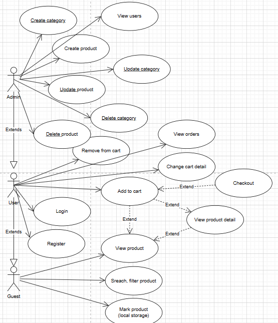
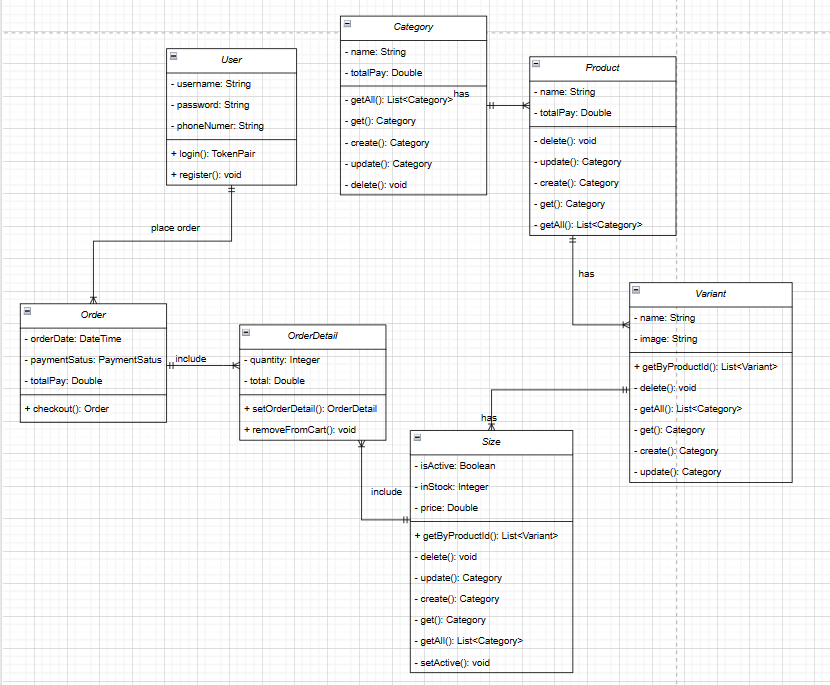

# 52100813 - Huỳnh Thanh Liêm
# E - SpringCommerce
# About this project
- Short Desciption
> The project is building a E-Commerce using `Spring boot` (java) as backend, `mysql` as system database,and `reactjs` for frontend part.

> I built an website allow the admin can manange their product as well as sell it online.

- Features
> Use case

- Data management
> class diagram

- Development pricples
> The project is develop in Scrum, with the period is 1 week. Every week I will preview the project and plan for what to do in the next week.

- System architecture
> In backend I use monolithic architecture by building REST api

> In frontend part I building Single page application using reactjs

- Demo
> [Click me to view demo](https://drive.google.com/drive/folders/14LbKYMWyzgK59ZyFzle5ccqrzl_Rry8D?usp=sharing)
# About this repo
> This is frontend part of the project

> The backend part is in: [limbanga/SpringCommerce](https://github.com/limbanga/SpringCommerce)

> Give me a star if you liked this :))
## Project Structure
- `src`: This folder contains all the source code files for the project.
- `components`: This folder contains reusable React components.
- `pages`: This folder contains the different pages of the application.
- `utils`: This folder contains utility functions or helper classes.
- `App.jsx`: The main entry point of the application.
- `main.jsx`: The file responsible for rendering the React app.
- `public`: This folder contains static assets that are served by the application.
- `index.html`: The HTML template for the application.
- `package.json`: The configuration file for the project, which includes dependencies, scripts, and other metadata.
- `README.md`: The readme file for the project, which provides information about the project and how to use it.
- Other configuration files like `.gitignore`, `.eslintrc`, etc. can be placed here.

## Routes in web
> This is frontend part, so I will describe the routes of this application
> `guest page`
- Home page.
> 
- Product detail page.
> 
- Login page.
> 
- Register page.
> 

> `user page`
- Cart page
> 
- Orders page
> 
- Order detail page
> 

> `error page`
- 404 Page.
> 
- 403 Page.
> 

> `Admin page`
- Admin dashboard page
> 
> 
> 
> 
- Change product page
> 
- Change category page
> 

- Admin orders page.
> 

## How to Run this project
> required: nodejs >= 20.09.x

> Steps
1. Clone this repo
2. Open `cmd` (or any comand line) and run `npm i` to install dependencies
3. run `npm run dev` to run the app.

> Video guide how to run. [link](https://drive.google.com/drive/folders/14LbKYMWyzgK59ZyFzle5ccqrzl_Rry8D?usp=sharing)

